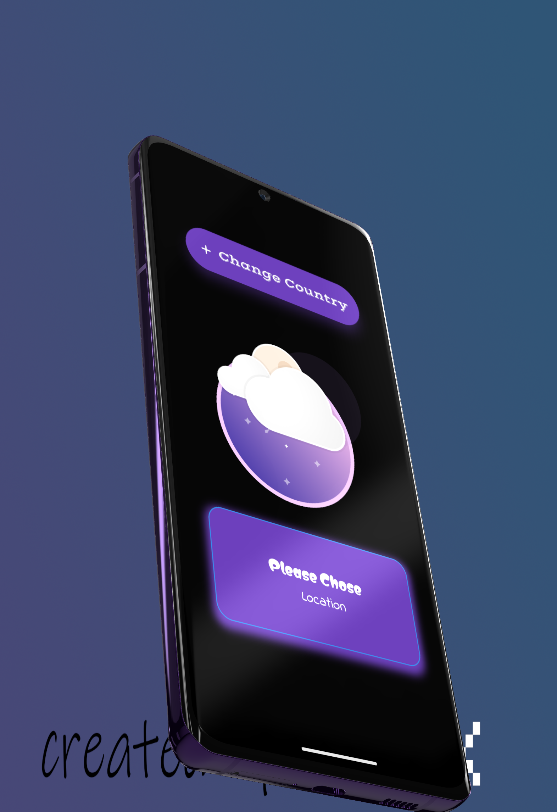
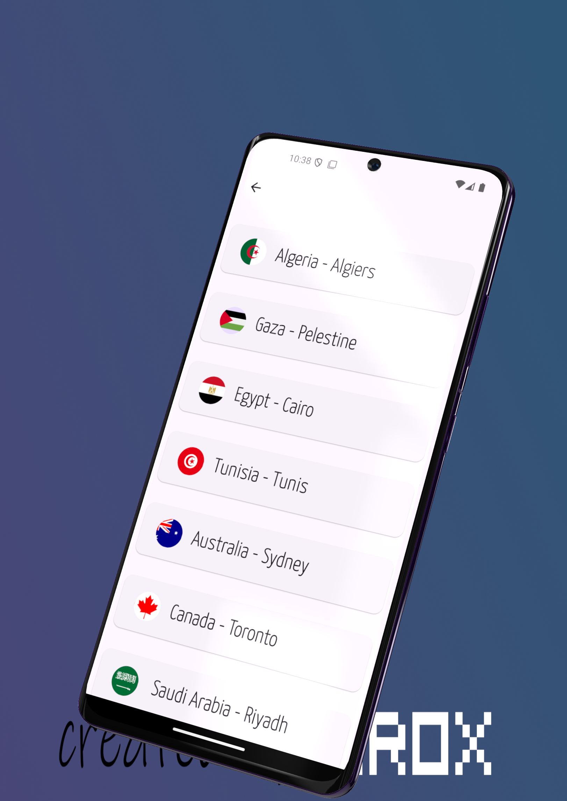
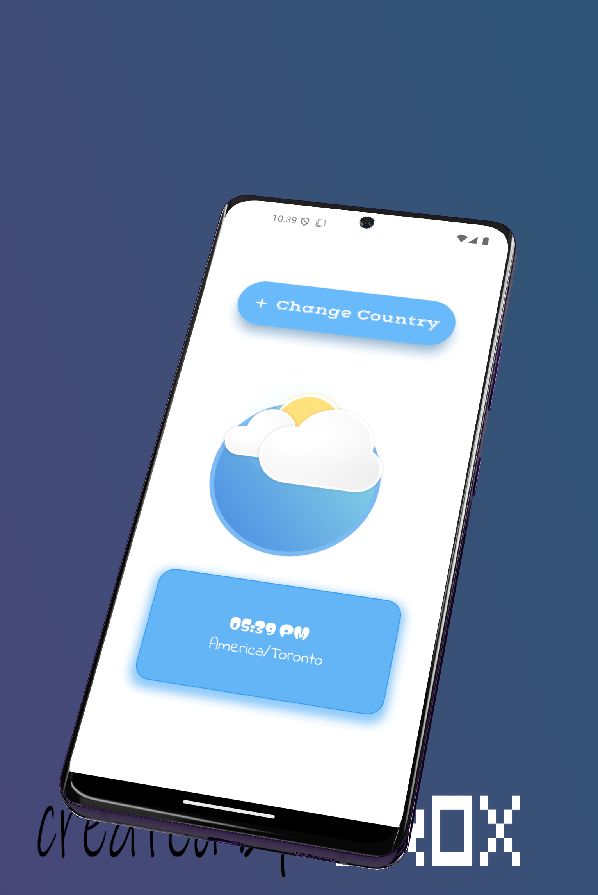
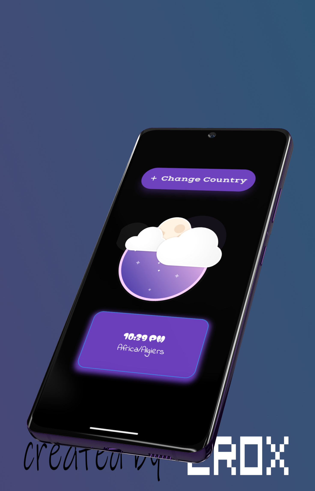

## Flutter World Time Application UI Design 
## About :
I make this application using this API http://worldtimeapi.org/api/timezone/$link
World Time API is a web-based API that provides time zone and current time data for various locations across the globe. It's designed to be a straightforward and reliable source for retrieving accurate and up-to-date information about the current time in different regions.
And  the design with figma


<br>

## Development Setup
Clone the repository and run the following commands:
```
flutter pub get
flutter run
```

## ScreenShot

&nbsp;
;;

;
